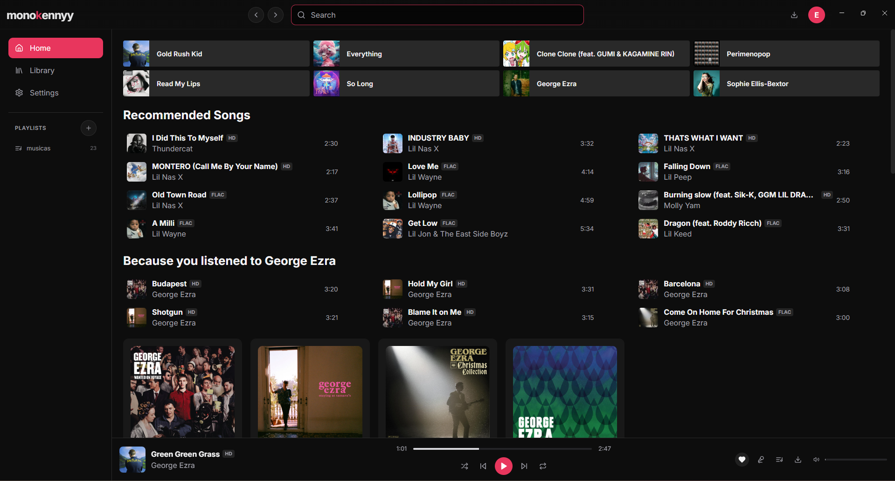
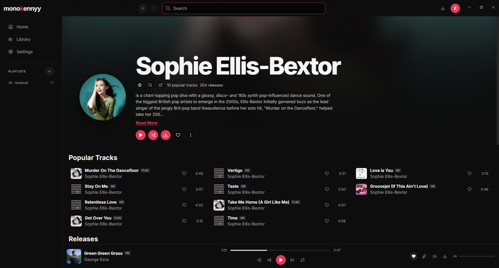
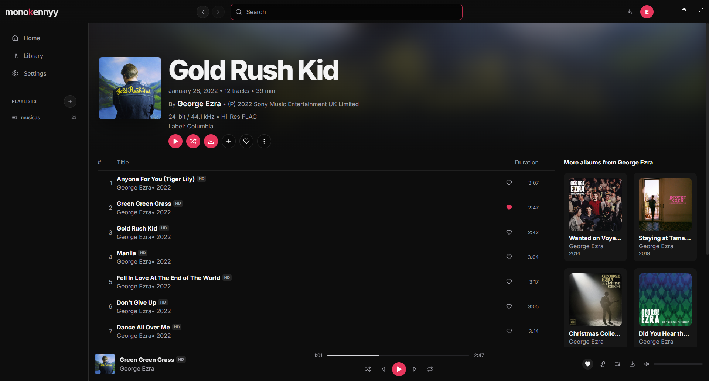
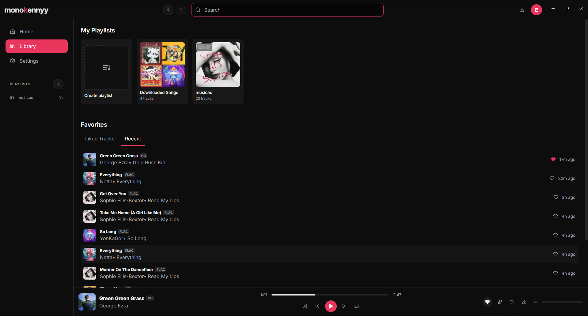

# monokennyy

A desktop music player built with Electron, React and TypeScript. Stream hi-res FLAC and HD audio with personalized recommendations, lyrics, playlists, and offline downloads.
This program was ENTIRELY inspired by [Monochrome](https://monochrome.tf)

## Screenshots

### Home

### Artist Profile

### Album View

### Library

## Features

- **Hi-Res Audio** — Stream in FLAC and HD quality
- **Smart Recommendations** — Personalized home feed based on your listening habits
- **Artist Profiles** — Bio, popular tracks, discography
- **Library** — Playlists, liked tracks, recent history
- **Offline Downloads** — Save tracks for offline playback
- **Lyrics** — Synced lyrics panel
- **Discord Rich Presence** — Show what you're listening to
- **Session Restore** — Picks up where you left off

## Tech Stack

- Electron
- React + TypeScript
- Vite

## Download

Check the [Releases](https://github.com/konnyoung/monokennyy-app/releases)
